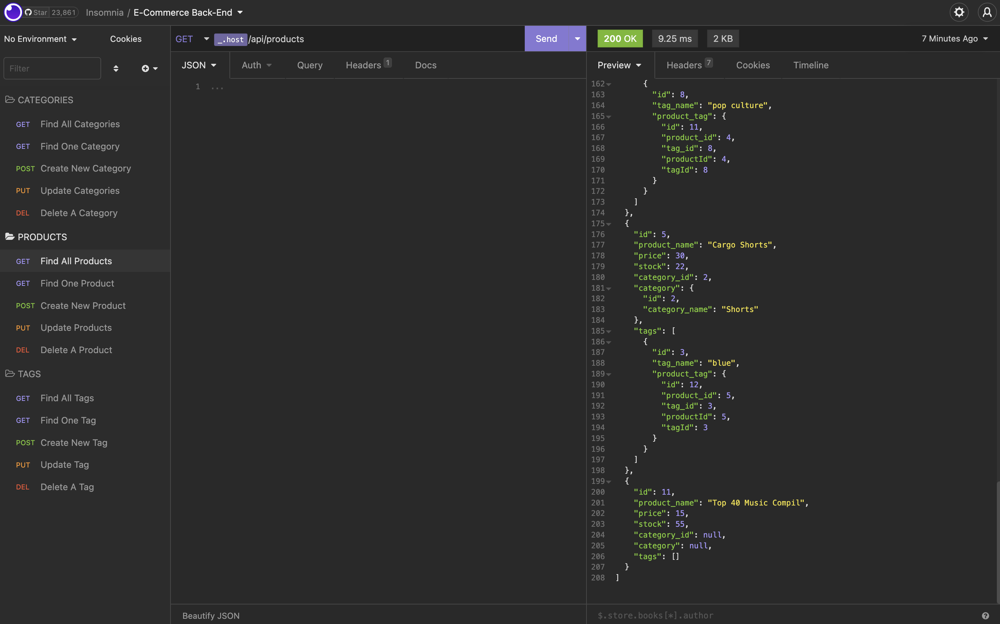

# E-Commerce-Back-End

#### E-Commerce Back-End [TheAnswer07](https://github.com/TheAnswer07)

#### E-Commerce-Back-End

## Table of Contents:

* [Project Description](#project-description)
* [User Story](#username)
* [Credits](#credits)
* [Features](#features)
* [Contribution](#contribution)
* [GitHub Profile Link](#github-profile)
* [GitHub App Link](#app-github-link)
* [Walkthrough video demonstrating App Functionality](#app-video-link)
* [Screenshot](#E-Commerce-Back-End)

### Project Description:

Internet retail, also known as e-commerce, is the largest sector of the electronics industry, having generated an estimated US$29 trillion in 2017 (Source: United Nations Conference on Trade and Development). E-commerce platforms like Shopify and WooCommerce provide a suite of services to businesses of all sizes. Due to the prevalence of these platforms, developers should understand the fundamental architecture of e-commerce sites.

This Back-End has been built for an e-commerce site using a working Express.js API configured to use Sequelize to interact with a MySQL database.

### User Story:

AS A manager at an internet retail company
I WANT a back end for my e-commerce website that uses the latest technologies
SO THAT my company can compete with other e-commerce companies

### Credits:

N/A.

### Features:

Express.js API configured to use Sequelize to interact with a MySQL database.

### Contribution:

You can contribute to this project by accessing my GitHub page.

### GitHub Link:
[GitHub Profile](https://github.com/TheAnswer07)

### App GitHub Link:

[GitHub App Link](https://theanswer07.github.io/E-Commerce-Back-End/)

### App Video Link:

[Walkthrough video demonstrating App Functionality](https://drive.google.com/file/d/1adFM7AyMKbvAiZC407W2MiZ4rGX6j7D1/view)

### Screenshot:

